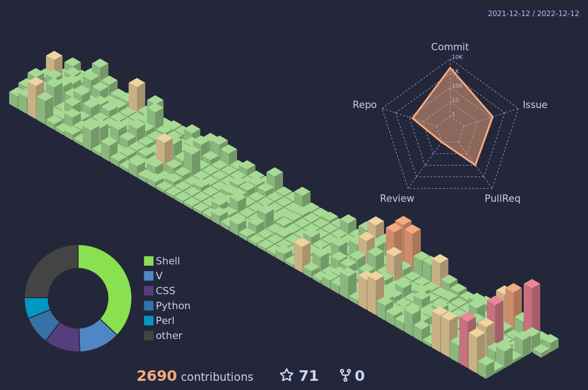

<!--
**sakkke/sakkke** is a ✨ _special_ ✨ repository because its `README.md` (this file) appears on your GitHub profile.

Here are some ideas to get you started:

- 🔭 I’m currently working on ...
- 🌱 I’m currently learning ...
- 👯 I’m looking to collaborate on ...
- 🤔 I’m looking for help with ...
- 💬 Ask me about ...
- 📫 How to reach me: ...
- 😄 Pronouns: ...
- ⚡ Fun fact: ...
-->

<!--

-->

[](https://github-readme-tech-stack.vercel.app/api/cards?title=My%20Tech%20Stack&lineCount=7&theme=catppuccin_macchiato&align=left&line1=html5,html5,auto;css3,css3,auto;javascript,javascript,auto;typescript,typescript,auto;&line2=v,v,auto;c,c,auto;cplusplus,c%2b%2b,auto;csharp,c%20sharp,auto;python,python,auto;&line3=gnubash,gnu%20bash,auto;vim,vim%20script,auto;neovim,neovim,auto;lua,lua,auto;&line4=astro,astro,auto;react,react,auto;vuedotjs,vue,auto;svelte,svelte,auto;&line5=visualstudiocode,visual%20studio%20code,auto;docker,docker,auto;inkscape,inkscape,auto;&line6=linux,linux,auto;archlinux,arch%20linux,auto;raspberrypi,raspberrypi,auto;&line7=arduino,arduino,auto;unity,unity,auto;nextdotjs,next.js,auto;nuxtdotjs,nuxt,auto;)

# Hello There!

I'm Konosuke, just a random student developer who loves creating a Linux distro (an operating system).
I love [Catppuccin](https://github.com/catppuccin/catppuccin) (especially, my favorite Catppuccin's flavor is *macchiato*), a very cool community-driven pastel theme, and Open Source Software!

- 🔭 I’m currently working on creating a Linux distro [Flight OS](https://github.com/sakkke/flightos).
- 🌱 I’m currently learning [V](https://github.com/vlang/v) (a programming language).
- 📫 How to reach me: [Email](mailto:w32w64@gmail.com)

And check out [my portfolio](https://classic-modern.netlify.app/)!
