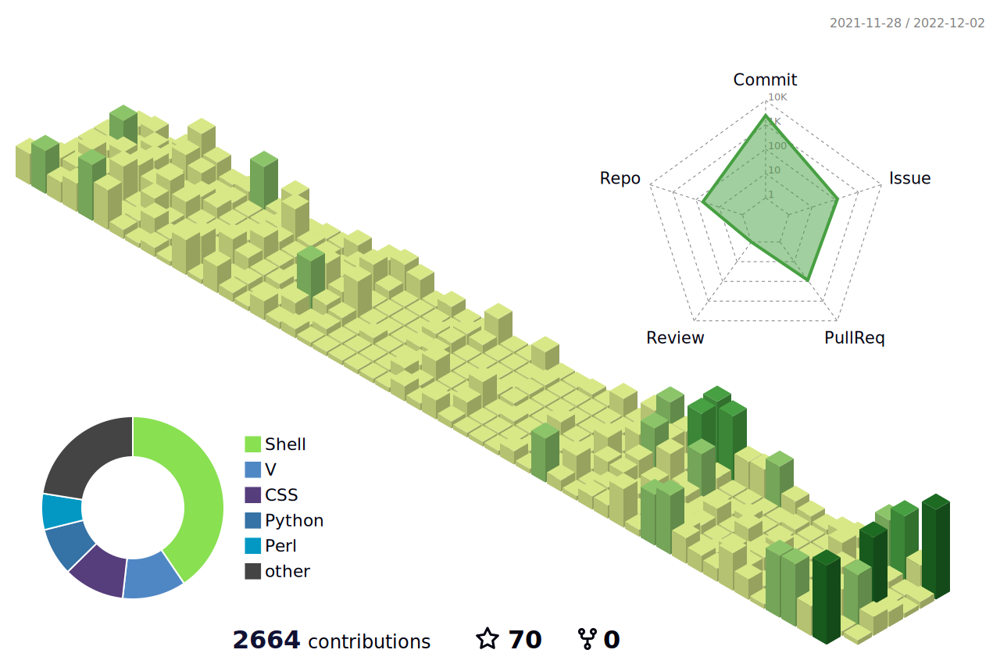

<!--
**sakkke/sakkke** is a ✨ _special_ ✨ repository because its `README.md` (this file) appears on your GitHub profile.

Here are some ideas to get you started:

- 🔭 I’m currently working on ...
- 🌱 I’m currently learning ...
- 👯 I’m looking to collaborate on ...
- 🤔 I’m looking for help with ...
- 💬 Ask me about ...
- 📫 How to reach me: ...
- 😄 Pronouns: ...
- ⚡ Fun fact: ...
-->



# Hello There!
I'm Konosuke, just a random student developer who loves creating a Linux distro (an operating system).
I love [Catppuccin](https://github.com/catppuccin/catppuccin) (especially, my favorite Catppuccin's flavor is *macchiato*), a very cool community-driven pastel theme, and Open Source Software!

- 🔭 I’m currently working on creating a Linux distro [Flight OS](https://github.com/sakkke/flightos).
- 🌱 I’m currently learning [V](https://github.com/vlang/v) (a programming language).
- 📫 How to reach me: [Email](mailto:w32w64@gmail.com)

And check out [my portfolio](https://classic-modern.netlify.app/)!

[](https://github.com/anuraghazra/github-readme-stats)

## Repos
### Dev
[](https://github.com/sakkke/dotfiles)

This is a work in progress.

### Operating System
[](https://github.com/sakkke/flightos)

```shell
# This is a work in progress.
flightos -d gh:sakkke/dotfiles -s gh:sakkke/flightos-alpha -u sakkke
```

### Catppuccin Port
[](https://github.com/catppuccin/tabby)
[](https://github.com/catppuccin/zutty)

### Web
[](https://github.com/sakkke/clock)
[](https://github.com/sakkke/classic-modern)

### V Package
[](https://github.com/sakkke/vfzf)

### Artwork
[](https://github.com/sakkke/inkscape-work)
